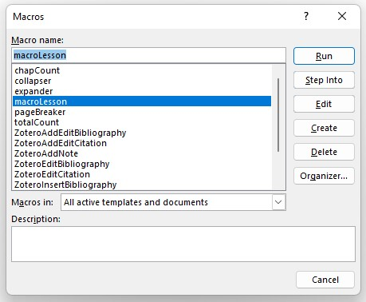

# word-count-macros

## Table of Contents
Follow links to reach sections. 
1. [Overview](https://github.com/clairewesson/word-count-macros#overview)
2. [Document Formatting Required by Code](https://github.com/clairewesson/word-count-macros#document-formatting-required-by-code)
3. [Using Section Breaks](https://github.com/clairewesson/word-count-macros#using-section-breaks)
4. [Download the code](https://github.com/clairewesson/word-count-macros#download-the-code)
5. [Installation Into Word](https://github.com/clairewesson/word-count-macros#installation-into-word)
6. [Code Alterations](https://github.com/clairewesson/word-count-macros#code-alterations)
7. [Updating Quick Access Toolbar](https://github.com/clairewesson/word-count-macros#updating-quick-access-toolbar)
8. [Using the Macros](https://github.com/clairewesson/word-count-macros#using-the-macros)
9. [Troubleshooting](https://github.com/clairewesson/word-count-macros#troubleshooting)

## Overview

### Macros

* A message outputting ALL chapter words counts
* A message outputting word count for a specified chapter
* Creation of new section for a new chapter 
* Expansion of all headers
* Collapse of all headers 

### Tutorial Scope
This tutorial is intended to be read and used by writers who have little to no experience with coding. I've done my best to break things down as simply as possible for ease of us, but if something seems unclear, 
don't be afraid to flag the issue under the `Issues` tab. I know this sort of thing can seem daunting if you don't have experience with code, and I would love to offer any amount of assistance that I can.  
* **Expected length of time to complete installation:** 10-15 minutes. 
* This tutorial is built for Windows. I do not have access to macOS, and cannot assist on that front. I would suggest looking up `.bas installation macOS` for further assistance. 

### Additional Notes
Because of how narrow the capabilities of VBA are, there are some parts of the code that you will have to update yourself - don't worry, I'll walk you through the [process](https://github.com/clairewesson/word-count-macros#code-alterations).    
In addition, there are some notes I'd like to share about the document formatting you'll have to manually complete in order for this code to work. 
Word itself has several functions that I've taken into account while coding these macros, and they require that you will have already taken advantage of certain functions. 
1. Full usage of the macros will depend on you manually setting what font/size/spacing you prefer under the Word Styles tab. I have written the code to account for usage of the `Normal` and `Heading 1` styles. 
To modify these specific styles, follow the instructions [at this link](https://support.microsoft.com/en-us/office/customize-or-create-new-styles-d38d6e47-f6fc-48eb-a607-1eb120dec563). DO NOT CHANGE THE NAME OF THE STYLE, ONLY THE FORMATTING. 
2. Familiarize yourself with how `Section Breaks` function. I prefer to use `Section Breaks` in my documents because you can add or remove text from one section without impacting the formatting of another section. 
Even if you decide not to use this code, understanding how `Section Breaks` function is something that can be beneficial to any writer. There are several types of `Section Breaks`, and all of them will work well with this code. 
However, I have decided to use the `Next Page` break in this code. If you would like to know how to insert a different type of `Section Break`, please let me know and I can add a section to this tutorial. 
3. You will need to know the number of `Section Breaks` that are in your document prior to adjusting and running the code. To quickly pull up the paragraph filter, press `ctrl+shift+8`. 
After each section, there will be a gray line that reads `Section Break`. Count how many gray `Section Break` lines you have before your `Chapter One`. You can hit `ctrl+shift+8` again to hide the lines.    

4. Once you have run a macro in a document, it can no longer be saved as a .docx file. This is normal. Word will prompt you to create a .docm file. 
Loading the macros into all documents will not cause this problem, only running them in the document you're working on will. Once you've run the macros in an existing file, 
you'll be prompted to save a copy of the document as a `.docm` file. 
To circumvent any potential loss of previous work, I would suggest making a copy of the document you intend to work on and practicing macros within the copy. 

## Document Formatting Required by Code
1. Document must be separated by section breaks, with each new chapter in its own section. 
2. Personally, in my document, I have two sections prior to chapter one: a title page, and a table of contents page. 
I like to keep these pages separate so that if I need to change something on the title page, the reformatting doesn't change the table of contents page. 
3. Chapter titles will need to be a consistent length. The `New Chapter` macro uses the format "Chapter XX", and I would suggest sticking with that. 
NOTE: The code currently accounts for two words per chapter title. If you want to make the title longer, you have two options: 
* You can wait until you have completed your manuscript. If the lengths of your titles are inconsistent, the word counts for each chapter will be wrong. 
* You can use a longer title, with dashes. Example: `Episode-One: The-Phantom-Menace` counts as two words in code, while `Episode One: The Phantom Menace` counts as five. Use the first option for consistency. 

## Using Section Breaks
To use a `Section Break`, you will need to work above the gray `Section Break` line. You can always use the keyboard shortcut to view the break if you are unsure of its location.    
   
I suggest separating the `Section Break` gray line onto it's own text line. To do this, place your cursor between the end of the text and the beginning of the gray line and hit `Enter` twice on your keyboard.   
   
Take note of how many gray lines you have inserted before your first chapter. This will be important for the code.   
Press `ctrl+shift+8` to hide the gray lines again.    

## Download the Code

1. Select the folder "VBA code" in the section above this tutorial or follow the [link](https://github.com/clairewesson/word-count-macros/tree/main/VBA%20code).
2. Select the file titled `wordUsageMacros.bas`. 
3. In the top right corner of the code, select the `Raw` button. 

4. On the new page, right click anywhere in the white space and select `Save Page As`. 
5. Save the file to whichever folder you want to. Ensure that the file type is either `.txt` or `.text` and that the file name ends in `.bas`. 
It should look like this automatically, but double-check just in case.    

## Installation into Word

1. Open a new word document. 
2. On the `View` tab, select the arrows underneath the `Macros` button.
3. Select `Record Macro`.    

4. Input the desired name for your macros. Do not select `OK` yet.  
NOTE: Name must not have spaces or special characters. Something like `chapWordCount` is acceptable. Do not select either `Button` or `Keyboard`.   

5. Select the Dropdown Menu titled `Store macro in`. If you want to apply the code *only to the current document*, select `[document name] Document`. 
If you want to apply it to all word documents, select `All Documents (Normal.dotm)`.   
   
NOTE: If you intend to use the Quick Access Toolbar, I would suggest applying the macro to `All Documents`. 
This will ensure that you will always have access to it. Otherwise, feel free to apply it only to your `current document`.
6. Select `OK`. 
7. The macro box will disappear, and it will look like nothing has changed. Don't panic. 
Click the arrow under the `Macros` box again, and select `Stop Recording`.    

8. Click the arrow under the `Macros` box one more time, and select `View Macros`. 
9. In the box that appears, highlight the macro you've just recorded and select the `Edit` button on the right-hand side.   

10. Delete all text in the window.  
  

11. Look to the left hand side of the editor. The document you are currently working within will be highlighted in gray. When you click it, it will change to blue.   

12. Above the module you are working in, which will either be labeled `Module 1` or `NewMacros`, there should be an open folder called `Modules`. Only select the folder that contains your highlighted module.  
NOTE: If you are trying to apply the code to ONLY your current document, the module will be called `Module 1`. If you are trying to apply it to all documents, the module with be called `NewMacros`.   

13. Right click the folder labeled `Modules` that contains the module you are working in. Select the button that says `Import File`.    

14. Navigate to the folder you stored the .bas file in. Select the file, and click `Open`.    

15. Congratulations, you've imported the code. It should be saved as `NewMacros` underneath the module you imported it into. 

## Code Alterations
1. Double-click the `NewMacros` you just created. 
This will open the code in the editor. 
2. Macros will be divided by section bars stretching across the editor. Under the first three sections, there will be a segment called `unique variables` in green text.    

3. The line `preChap = 2` refers to the number of sections prior to chapter one. Using that count of gray `Section Break` lines you took earlier, change the number `2` to reflect your count. 
Make sure that your number change stays in the same format as the line. For example, if you have 5 section breaks prior to Chapter 1, type in `preChap = 5`
4. The line `titleCount` refers to the number of words you intend to use in each title. If you are following the `Chapter X` format, leave it as `titleCount = 2`. 
If you intend to use the `Chapter X: Chapter-name` format, change it to `titleCount = 3`.
See [above](https://github.com/clairewesson/word-count-macros#document-formatting-required-by-code) for a more detailed explanation. 
5. You will have to repeat this process three times, changing the `unique variables` section for the first three macros sections. 
6. When you have completed those changes, you can exit out of the editor. It will save automatically, so you do not need to manually save it. 
7. Congrats, you're ready to create the buttons to run the code!

## Updating Quick Access Toolbar 
1. Return to your document. Right-click on the ribbon at the top of the document.    

2. Select `Show Quick Access Toolbar`
3. A thin, gray bar will appear below the main ribbon. Right click it.   

4. Select `Customize Quick Access Toolbar`
5. A new box will appear. A dropdown titled `Choose Commands From` will be in the upper left.   

6. Select the dropdown and choose the option `Macros`.   

7. A list of macros will appear below. If you applied the macros to all documents, then they will be titled `Normal.NewMacros.[macro name]`.
If you applied the macros to only the document you're working in, they will be titled `Project.NewMacros.[macro name]`. Select whichever one is appropriate for your purposes.    

8. On the top right, there is another dropdown. To add the button to all documents, select the `All Documents` option. To select only the document you're in, click the dropdown and select `[Document Name]`.   

9. Highlight the macro you'd like to add to the toolbar. In the center, there should be a button labeled `Add >>`. Select that. The macro you've chosen should add to the list on the right. 
Add all of the macros one by one.   

10. On the right-hand side, click the first macro. At the bottom of the list, select the button labeled `Modify`. A new box will pop up.   

11. You can change the button icon here by selecting a new one from the image list. Change the button name in the `Display name` section. These are the titles I'd suggest: 
* `Normal.NewMacros.totalCount`: All Counts
* `Normal.NewMacros.chapCount`: Chapter Word Count
* `Normal.NewMacros.pageBreaker`: Insert New Chapter
* `Normal.NewMacros.collapser`: Collapse All
* `Normal.NewMacros.expander`: Expand All 
12. When you've finished modifying all of your buttons, select `OK` in the bottom right. Your toolbar will now have the buttons you added.   

13. Congrats! You've completed the process of adding your buttons. You're now ready to try and use them. 

## Using the Macros
To use any of the macros, simply press the button you've created in the toolbar. 
1. `All Counts` will return a list of all chapter word counts.    

2. `Chapter Word Count` will return an input box. Input the chapter number you want in integer format (ex: `1`, `15`). 
Entry will return the word count for the requested chapter. Improper entry will return an error message. If a chapter has no words written, you will receive an info box telling you that you have not written anything.    
   
   
NOTE: If you select `Cancel` on the input box, you will get an error saying `Run-time error '13. Type mismatch`. Select the button that says `End`.    

3. `Insert New Chapter` will append the end of the document with a new section break and sequential chapter title. 
4. `Collapse All` will allow you to collapse all headings. This functionality is particularly useful when working in large documents. Collapsing all sections can take a 400 page manuscript and collapse it to 20 pages, making scrolling easier. 
5. `Expand All` will reverse the `Collapse All` button, expanding all sections completely.    

## Troubleshooting
### Page Numbers are Restarting at Each Section
Utilizing `Section Breaks` has one major weakness: page numbering. Sometimes, Microsoft Word will assume that a new section means you want to start your page numbers over from 1. 
This doesn't *always* happen, but if you have noticed that your numbers are looping at every section, follow these steps: 
1. Right click the page number and select `Edit Header` or `Edit Footer`.   

2. Select `Format Page Numbers. 
3. A box will open. Under the `Page numbering` section, select the option `Continue from previous section`.   

4. Repeat this process for every affected section. 
